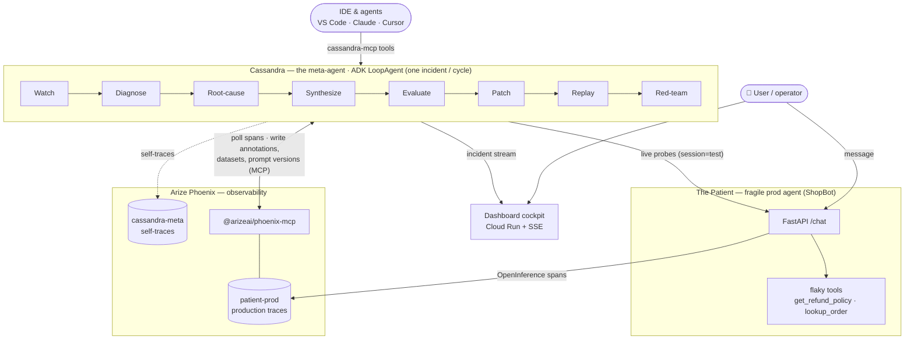

# Cassandra — The Meta-Agent That Watches Other Agents

> **Agents fail silently. Cassandra hears them.**
>
> Cassandra is an AI agent whose only job is to supervise *other* AI agents. It watches a
> production agent through Arize Phoenix traces, catches hallucinations, prompt drift, and
> tool-call failures in real time, turns each failure into an adversarial eval dataset,
> proves a prompt fix against it, replays the original failing input, and red-teams its own
> fix — writing every artifact back into Phoenix. No human in the loop.

<sub>Built for the Google Cloud Rapid Agent Hackathon (Arize track). Apache-2.0.</sub>

---

## The problem

Every team running LLM agents in production shares one unsolved problem: **agents fail
quietly and confidently.**

- A support bot invents a refund policy that doesn't exist.
- A tool call returns nothing and the agent papers over the gap with a fabricated delivery date.
- A model upgrade drifts a prompt's behavior overnight.

Today this is caught by **humans staring at trace dashboards** — sampling conversations by
hand, writing eval datasets manually, and editing prompts on intuition. It's slow, it
doesn't scale, and most failures are never caught at all.

## The product

Cassandra closes that loop autonomously. It connects to the observability platform your
agent already exports traces to (Arize Phoenix) and runs the exact workflow Phoenix was
built for — but **automated, continuous, and self-improving.** One incident goes in; one
verified, evidence-backed prompt patch comes out.

```
 watch ─▶ diagnose ─▶ root-cause ─▶ synthesize evals ─▶ evaluate
                                                            │
        red-team ◀─ replay ◀─ patch ◀────────────────────┘
```

| Stage | What happens |
|-------|--------------|
| **Watch** | Poll fresh production traces from Phoenix; one incident per cycle, deduped by span. |
| **Diagnose** | An LLM-as-judge classifies the failure — *hallucination / prompt-drift / tool-failure* — with confidence and severity, and annotates the span. |
| **Root-cause** | Pinpoint the culprit and the causal chain: which tool returned nothing, which prompt line told the model to fabricate. |
| **Synthesize** | Turn that single failure into an adversarial eval dataset, written back into Phoenix. |
| **Evaluate** | Score the current prompt against the dataset, live, on the real agent. |
| **Patch** | Rewrite the system prompt to close the failure — registered as a Phoenix prompt version with a unified diff. |
| **Replay** | Re-run the *exact* original failing input on the patched prompt and judge whether this case is now fixed. |
| **Red-team** | Fire the adversarial probes at the live agent — baseline vs. patched — and report the survival rate. |

Every artifact (annotation, dataset, experiment scores, prompt version) lands in Phoenix,
where your team already works.

## The recursive twist

Cassandra also **watches itself.** Its own reasoning is traced into a second Phoenix
project (`cassandra-meta`), and a built-in self-evaluation runs a hand-labeled trap library
through its own Diagnostician and scores its diagnostic accuracy against ground truth. The
supervisor is as observable — and as measurable — as the agents it supervises.

> The watcher, watching itself. *(Current diagnostic self-score: 100% — 11/11 on the OpenAI backend.)*

## Architecture at a glance

Two **separate** agents that communicate *only* through Phoenix telemetry. Cassandra never
touches the Patient's internals — it supervises *through observability*, exactly as a real
meta-agent would. (The one exception is a sandboxed `session_id="test"` probe path used by
evaluate/replay/red-team, which the Watcher filters out so Cassandra never supervises itself
into an infinite loop.)



## See it work

A live cockpit. You type a customer message; the victim agent (**"the Patient"** — a
deliberately fragile ShopBot) confidently invents a refund policy. Seconds later Cassandra
catches it in the trace feed and the full pipeline plays out on screen: the diagnosis, the
causal chain, the synthesized attack set, baseline-vs-candidate pass rates, the prompt diff,
the before/after replay, and the red-team table. Then you press **"Grade my own diagnoses"**
and Cassandra scores itself.

```bash
pip install -e ".[dev]"
cp .env.example .env            # fill in OpenAI/Gemini keys + Phoenix URLs

uvicorn patient.agent:app --port 8082 --reload   # 1. the Patient (ShopBot)
uvicorn dashboard.main:app --port 8085 --reload  # 2. cockpit at :8085 (animated explainer at /how)
python scripts/run_pipeline.py                   # 3. drive one full supervision cycle

pytest                          # offline unit tests (LLM + MCP mocked)
```

> The cockpit is a single self-contained file (`dashboard/ui/index.html`) served directly by
> the dashboard — no Node/Vite build step. The legacy `web/` React app is no longer wired in.
> Public deploys must also set `REPLAY_SHARED_SECRET` on both services (see `deploy/cloudbuild.yaml`).

## Three ways to use it

Cassandra isn't just a demo — it's distributed as tools you can drop into your own workflow.

### 1. In your IDE — zero infrastructure

Cassandra publishes its own MCP server (`cassandra-mcp`), so any agent or IDE
(VS Code Copilot, Claude Desktop/Code, Cursor) can call the meta-agent directly:

| Tool | What it does | Touches Phoenix? |
|------|--------------|:---:|
| `diagnose(customer_input, agent_output, tool_calls?)` | LLM-as-judge verdict (hallucination / prompt-drift / tool-failure) | — |
| `synthesize_evals(failure_class, why_it_failed, original_input, bad_output, n?)` | turn one failure into an adversarial eval set | — |
| `propose_patch(current_prompt, failure_summary, triggering_input, bad_output)` | rewrite a system prompt + unified diff | — |
| `gate_prompt(prompt, cases, threshold?)` | CI regression gate; `passed=false` blocks the change | — |
| `supervise_latest()` | run the **full** loop on the latest trace and return a paste-ready postmortem | ✅ |
| `self_evaluate()` | grade Cassandra's own diagnostic accuracy vs. labeled ground truth | — |

[](https://vscode.dev/redirect/mcp/install?name=cassandra&inputs=%5B%7B%22id%22%3A%22openai_api_key%22%2C%22type%22%3A%22promptString%22%2C%22description%22%3A%22OpenAI%20API%20key%20%28judge/synthesis%20backend%29%22%2C%22password%22%3Atrue%7D%5D&config=%7B%22type%22%3A%22stdio%22%2C%22command%22%3A%22cassandra-mcp%22%2C%22env%22%3A%7B%22OPENAI_API_KEY%22%3A%22%24%7Binput%3Aopenai_api_key%7D%22%2C%22PHOENIX_BASE_URL%22%3A%22http%3A//localhost%3A6006%22%2C%22PHOENIX_API_KEY%22%3A%22local%22%2C%22PATIENT_ENDPOINT%22%3A%22http%3A//localhost%3A8082/chat%22%7D%7D)

Click the badge (it prompts for your key and registers the server), or add a server block to
`.vscode/mcp.json` (Copilot) / `claude_desktop_config.json` (Claude) / `.cursor/mcp.json`
(Cursor) — cloning this repo already gives you the VS Code file:

```json
{
  "servers": {
    "cassandra": {
      "type": "stdio",
      "command": "cassandra-mcp",
      "env": {
        "OPENAI_API_KEY": "sk-...",
        "PHOENIX_BASE_URL": "http://localhost:6006",
        "PHOENIX_API_KEY": "local",
        "PATIENT_ENDPOINT": "http://localhost:8082/chat"
      }
    }
  }
}
```

```bash
pip install -e .
cassandra-mcp                 # or: python -m cassandra.mcp_server
```

And it's not ShopBot-only: point `PATIENT_PROJECT` / `PATIENT_ENDPOINT` at **your** agent —
see ["Bring your own agent"](docs/WORKFLOWS.md#bring-your-own-agent) and the drop-in
[`examples/adapter_template.py`](examples/adapter_template.py).

### 2. In CI — a prompt regression gate

Prompts are code, so test them like code. `cassandra-gate` scores a system prompt against an
eval dataset by running every case through your live agent and judging each answer, then
**fails the build** when the pass rate drops below the threshold:

```bash
cassandra-gate --prompt-file prompts/system_prompt.txt \
               --cases evals/cases.json --threshold 0.8
```

The dataset format is exactly what Cassandra's Synthesizer emits — so every production
incident it handles can be committed as a regression suite that guards all future prompt
changes. Failures compound into protection. Ready-to-copy GitHub Actions workflow:
[`examples/github-actions-prompt-gate.yml`](examples/github-actions-prompt-gate.yml).

### 3. On call — auto-postmortems

Every completed supervision cycle writes `reports/<incident_id>.md` — a paste-ready
postmortem with the diagnosis, severity, root-cause chain, baseline-vs-candidate pass rates,
the prompt diff, before/after replay evidence, and the red-team table. File it as a GitHub
issue (`gh issue create --body-file reports/<id>.md`), drop it in Slack, or attach it to the
PR that applies the patch. The `supervise_latest` MCP tool returns the same markdown.

## Built with

- **Reasoning core** — Gemini on Vertex AI, with OpenAI (`gpt-4o` / `gpt-4o-mini`) and
  OpenRouter fallbacks; backend selected at runtime by env.
- **Orchestration** — Google ADK `LoopAgent` wrapping a real custom `BaseAgent` supervision
  cycle (google-adk 2.1.0); all business logic stays in plain, unit-tested Python.
- **Runtime** — Vertex AI Agent Engine.
- **Partner observability (required)** — Arize Phoenix via the `@arizeai/phoenix-mcp` server,
  consumed through a single gateway.
- **Published MCP** — a custom `cassandra-mcp` server exposing the supervision loop as tools.
- **Hosting / state / secrets** — Cloud Run (dashboard), Firestore (durable cursor + dedupe),
  Secret Manager (keys). Optional: BigQuery for long-term span analytics.

## How the codebase is organized

Two **separate** agents that communicate *only* through Phoenix telemetry — the pipeline is
agent-agnostic and never imports from `patient/`.

```
cassandra/
├── patient/              # the fragile "ShopBot" victim agent
│   ├── agent.py          #   Gemini/OpenAI agent + FastAPI /chat + OpenInference spans
│   └── tools.py          #   intentionally flaky get_refund_policy / lookup_order
├── cassandra/            # the meta-agent (8-stage pipeline)
│   ├── models.py         #   Incident (threaded through every stage), Verdict, Severity, …
│   ├── phoenix_mcp.py    #   the single Phoenix MCP gateway
│   ├── llm.py            #   Gemini / OpenAI / OpenRouter structured/text helper
│   ├── watcher.py        #   poll spans since durable cursor (skips session=test)
│   ├── diagnostician.py  #   LLM-as-judge → annotate span + severity
│   ├── rootcause.py      #   culprit + causal chain + fix strategy
│   ├── synthesizer.py    #   adversarial dataset → Phoenix dataset
│   ├── evaluator.py      #   live baseline vs. candidate scoring + efficiency
│   ├── patcher.py        #   prompt patch → Phoenix prompt version + diff
│   ├── replay.py         #   re-run the original failing input on the patch
│   ├── redteam.py        #   adversarial probes at the live agent
│   ├── selfeval.py       #   grade its own diagnoses vs. traps.py ground truth
│   ├── loop_agent.py     #   pipeline + real ADK LoopAgent/BaseAgent shell
│   ├── mcp_server.py     #   cassandra-mcp: publishes supervision as 6 MCP tools
│   ├── gate.py           #   cassandra-gate: CI prompt regression gate
│   └── report.py         #   auto-postmortem renderer
├── dashboard/ui/index.html  # self-contained OLED cockpit (no build step)
├── deploy/               # cloudrun.Dockerfile, cloudbuild.yaml, agent_engine.py
└── tests/                # offline unit tests (LLM + MCP mocked)
```

## Documentation

| Doc | Purpose |
|-----|---------|
| [docs/PITCH.md](docs/PITCH.md) | The narrative pitch — for the website, Devpost page, and demo video |
| [docs/WORKFLOWS.md](docs/WORKFLOWS.md) | How to actually use Cassandra: IDE copilot, CI gate, live supervision, postmortems |
| [docs/DEPLOYMENT.md](docs/DEPLOYMENT.md) | Google Cloud deploy guide: Cloud Run + Vertex AI Agent Engine |
| [docs/ARCHITECTURE.md](docs/ARCHITECTURE.md) | System & agent architecture, data flow, MCP surface |
| [docs/SYSTEM_DESIGN.md](docs/SYSTEM_DESIGN.md) | Plain-language design: every workflow narrated, flaws table, security audit |
| [docs/PRD.md](docs/PRD.md) · [docs/REQUIREMENTS.md](docs/REQUIREMENTS.md) | Product requirements & FR-*/NFR- specs |
| [docs/DISTRIBUTION.md](docs/DISTRIBUTION.md) | Post-hackathon distribution & monetization roadmap |
| [docs/sessions/](docs/sessions/) | Per-session change log — the project's durable working memory |

## Status

**Deployed and verified end-to-end in the cloud.** Live demo:
**<https://elianna-unpolymerized-confidingly.ngrok-free.dev>** — the React cockpit (single-file
cockpit also at `/cockpit`) + supervised agent run on a Google Compute Engine VM (asia-south1)
against an **Arize Cloud Phoenix** space. The full pipeline — diagnose → root-cause → synthesize → evaluate → patch →
replay → red-team — has completed full autonomous cycles on the hosted deployment:
hallucination caught from live traces, a 12-case adversarial dataset and a candidate
prompt version written back into Phoenix, the original failing input replayed to a
**FIXED** verdict, and an auto-postmortem generated. 39 offline tests passing; live
diagnostic self-score 10/11 (91%). Both Gemini and OpenAI backends supported.

The hosted demo runs on **Vertex AI Gemini** (`gemini-2.5-flash-lite`) — Google Cloud AI,
per the hackathon's Gemini requirement. Also deployed to **Vertex AI Agent Engine** (the
managed ADK runtime) — resource
`projects/905502723393/locations/us-central1/reasoningEngines/1519338702365523968`,
live and queryable (`python -m deploy.agent_engine`).

## License

Apache-2.0 — see [LICENSE](LICENSE).
